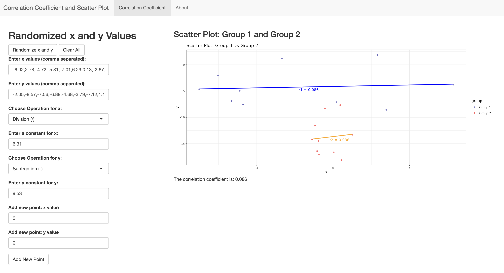

# Correlation Coefficient Visualizer

An interactive Shiny application for exploring the behavior of Pearson's correlation coefficient under different transformations for an introductory statistics course.

## Live Demo

https://github.com/JaydenZhou0/Correlation-Coefficient-Visualizer/tree/main

## App Preview

## Overview

This project visualizes how Pearson's correlation coefficient changes (or remains invariant) when applying transformations to variables.

Users can:

* Randomly generate paired data
* Add custom points
* Apply arithmetic transformations to variables
* Exchange x and y variables
* Compare scatterplots before and after transformation
* Observe how the correlation coefficient changes in real time

The application is designed as an educational tool for statistics students learning the geometric and algebraic interpretation of correlation.

## Features

* Interactive scatterplot visualization
* Dynamic correlation coefficient calculation
* Linear regression overlays
* Side-by-side comparison of transformed datasets
* Real-time updates with Shiny

## Technologies

* R
* Shiny
* ggplot2

## Educational Goals

This app demonstrates several important statistical properties of Pearson correlation:

* Translation invariance
* Scale invariance
* Symmetry of correlation
* Sensitivity to linear transformations
* Effects of adding outliers

## Authors

* Ivy Gu
* Jayden Zhou
